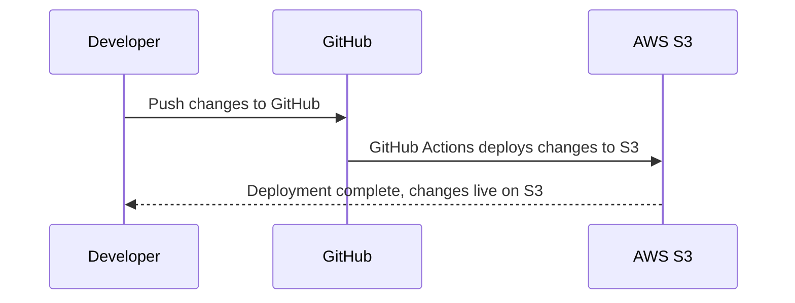
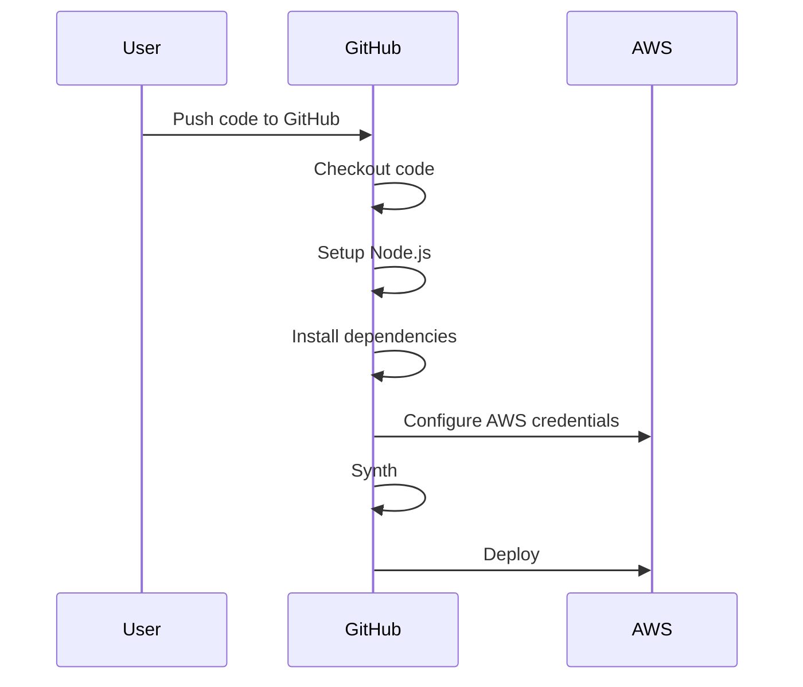

# Portfolio Platform

Portfolio platform allows developers to build, manage, and deploy their portfolios. The system is designed as a monorepo including both the frontend and backend, and leverages AWS CDK for managing infrastructure.

Demo link: http://portfoliodemo.sagara.me/

## Features

- AWS S3 for static website hosting and blog articles
- DynamoDB for storing contact form responses
- AWS Lambda functions for serverless operations
- Custom domain setup with AWS Route 53
- Admin dashboard for content management

## Kickstart

Before you begin, make sure you have the following prerequisites:

- An AWS Account
- Node.js installed locally
- AWS CDK installed and configured
- A GitHub account

First, fork this repository to your own GitHub account. Then, clone the forked repository to your local machine using:

```sh
git clone https://github.com/{your-username}/portfolio-platform.git
```

Navigate to the backend directory, install dependencies and bootstrap the CDK:

`cd portfolio-platform/infrastrucutre/cdk
npm install
cdk bootstrap
`

Navigate to the frontend directory, install dependencies:

`cd ../packages/frontend
npm install
`
### Safeguard Your Secrets

Add following secrets to the github profile

- AWS_ACCESS_KEY_ID
- AWS_SECRET_ACCESS_KEY
- AWS_ACCOUNT_ID

### A Little Tweak

- Goto infrastructure\cdk\lib\backend-stack.ts
- Update the domainName prop

### Deploying the frontend app

### Deploying the CDK as infrastructure

### Updating Nameservers: The Final Step 

- You can find nameservers related to your domain once you are done with the deployement.
- Visit your domain registras to update your nameservers. 
## Contributing

Pull requests are welcome. For major changes, please open an issue first to discuss what you would like to change.

## License

[MIT](https://choosealicense.com/licenses/mit/)

Please replace `{your-username}` with your actual GitHub username in the clone URL. As you make progress with your project, be sure to keep your README up-to-date, adding specific instructions for running your app, tests, and any other important information for users and contributors.
